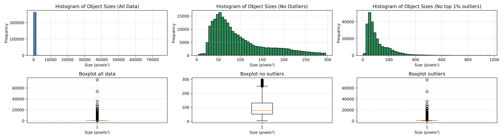

# Labels analysis
## Output

```
(.venv) szymon@DESKTOP-GV36UB4 ~/code/posgrado/postgraduate-proj-telescope-img-analysis (feat/data-analysis)$ python -m dev_utils.analyse_labels.analyse_labels 
initial_read | 222
initial_filter | 8
Num files found: 770
Num objects found: 262321
Max Width: 360.410 pixels
Min Width: 1.850 pixels
Average Width: 9.366 pixels
Average Length: 11.200 pixels
Max Length: 710.729 pixels
Min Length: 2.036 pixels
Average Size: 128.39 pixels²
Average Ratio to Image: 0.00000763 (0.00076%)

Top 10 Largest Objects by Size:
          X_IMAGE   Y_IMAGE  ALPHA_J2000  ...      length           size     ratio
91808   1032.3981  305.0559   306.128049  ...  710.728520  256153.665893  0.015223
67218   1074.2648  747.7528   114.212855  ...  333.893360   74872.247046  0.004450
67216   1106.8561  680.9362   114.204849  ...  256.867650   53425.902523  0.003175
70483   1008.8295  815.7784   114.226979  ...  219.920050   35484.100067  0.002109
57554    620.6854  313.6909   210.973580  ...  219.072700   29809.222289  0.001772
129331   717.7337  900.1809   210.802346  ...  178.137200   26756.207440  0.001590
128061   452.3699  479.0656    76.362717  ...  206.041820   26467.101988  0.001573
99505    502.2875  509.8447   345.014984  ...  188.490325   23145.669458  0.001376
241824   585.8442  493.6674   345.014900  ...  186.324600   22543.413354  0.001340
102044   471.6695  493.1967   345.015077  ...  185.908355   22399.168152  0.001331

[10 rows x 24 columns]
Num objects after filtering: 262307
Num invalid objects after filtering: 14
Num unique files with invalid values 14


num objects top 1%: 1312
Num unique files with top 1% outliers 247
Num unique files with outliers 603


non_outliers Max Width: 17.065 pixels
non_outliers Min Width: 1.850 pixels
non_outliers Average Width: 8.738 pixels
non_outliers Average Length: 10.319 pixels
non_outliers Max Length: 23.739 pixels
non_outliers Min Length: 2.036 pixels
non_outliers Average Size: 99.14 pixels²
non_outliers Average Ratio to Image: 0.00000589 (0.00059%)

Outlier Thresholds:
 - Lower bound: 0.00
 - Upper bound: 295.91

Detected 14930 outlier(s) based on size:

non_outliers Top 10 Largest Objects by Size:
            x_min        y_min      x_max        y_max  class_id        size
121794   317.9573    13.778840   334.2773    31.910360         1  295.906406
182165   284.1223   153.638593   299.1573   173.319408         2  295.901054
185845  1456.2139  1190.229950  1471.8389  1209.167450         1  295.898438
166061  1065.7235   664.957875  1081.8485   683.308125         1  295.897781
141102  1731.3885  2015.327410  1747.3185  2033.901790         1  295.889873
166240  1638.2074   882.417710  1654.1374   900.992090         1  295.889873
225500   192.0170   496.048300   207.3170   515.387500         1  295.889760
23058   1567.3651  1954.044350  1582.8751  1973.121650         1  295.888923
184274   462.3266  1925.379238   479.2016  1942.912362         1  295.871484
189216  1184.9257  1351.302575  1200.8007  1369.939825         1  295.866344
```



## Conclusions
- Out of 1000 provided label files there are 222 that are empty and further 8 that are effectively empty after filtering objects of no interest. 
- Total number of objects of interest is 262321 among 770 files
- This number is reduced to 262307 after filtering invalid objects (14 objects)
    - objects is considered invalid if it contains negative coordinates
    - _max coordinate < _min coordinate
    - _max coordinate > img_size
    - the invalidity occurs mostly because of scaling which makes the objects slightly out of bounds
- Top 0.5% of objects in terms of size consists of 1312 objects
    - Spread among 247 unique files
- 14930 objects can be considered outliers (~5.7%)
    - Spread among 603 unique files

### Object size
#### All objects
- Average Size of an object (all objects): 128.39 pixels²
- Average Ratio to Image: (all objects) (0.00076%)
#### All objects except top 0.5%
- Average Size: 116.12 pixels²
- Average Ratio to Image: 0.00000690 (0.00069%)
#### All objects except outliers
- Average Size: 99.14 pixels²
- Average Ratio to Image: 0.00000589 (0.00059%)

## Possible actions
- Clip invalid objects so that they don't extend beyond image
- Remove top 0.5% by size objects to remove larger outliers
    - Remove just objects as there should be roughly 5 of them per file
    - Remove entire files - means losing more data for exchange of having the data cleaner