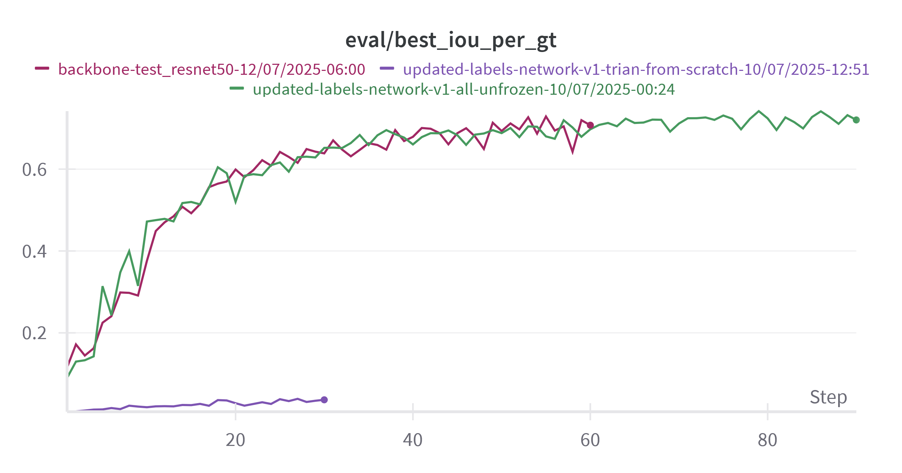
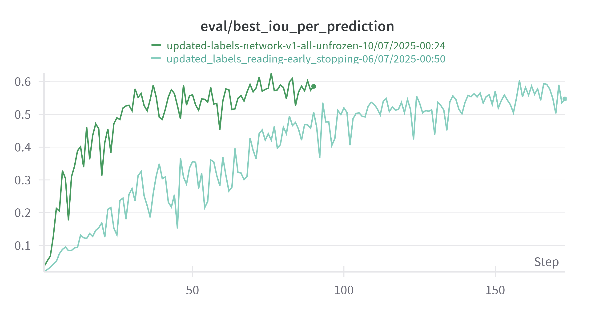
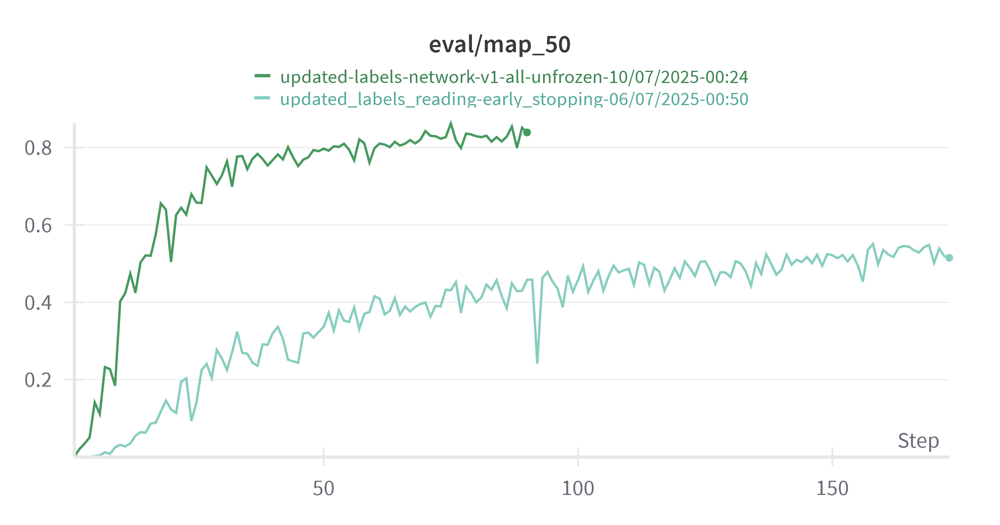
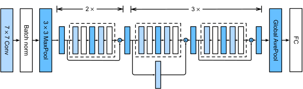
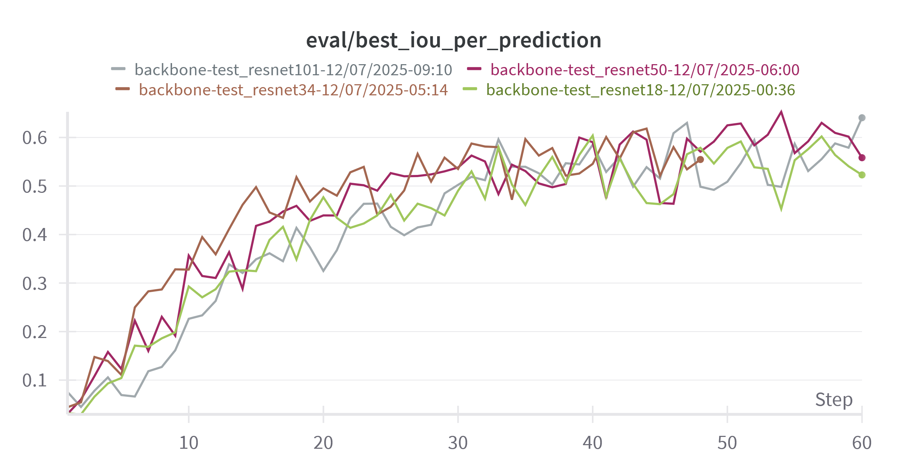
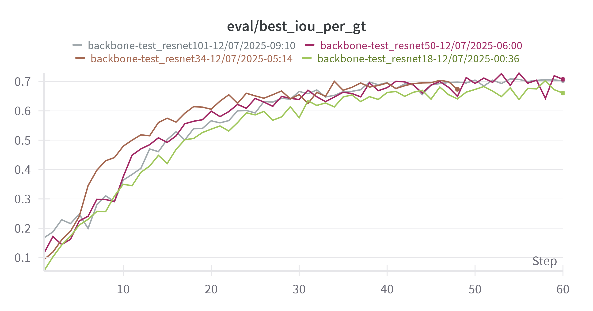
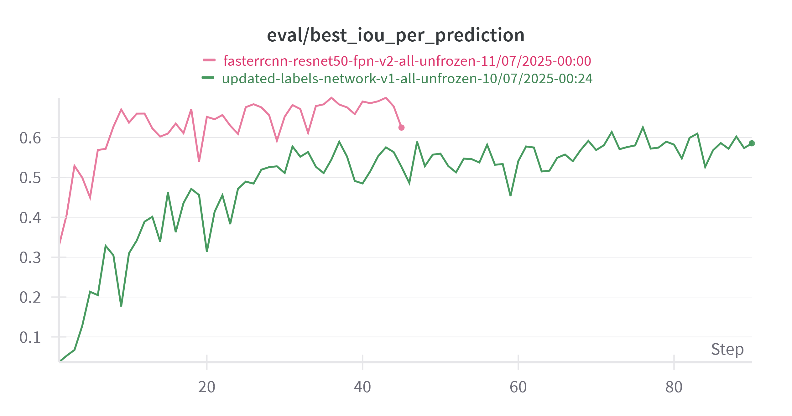
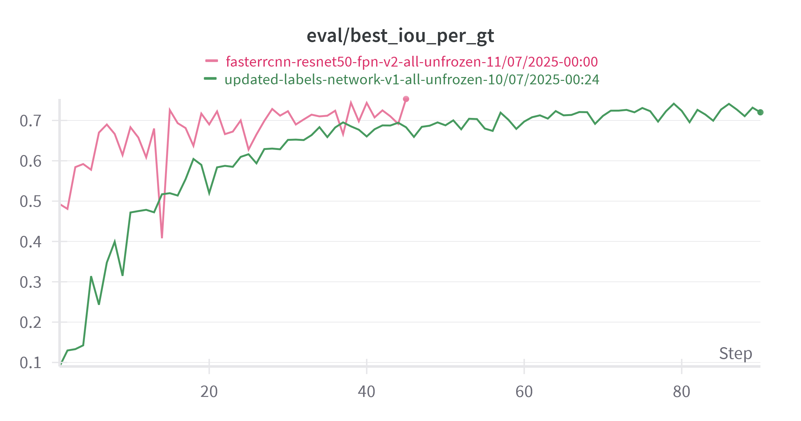

# Model experiments
In this chapter, we describe our approach to identifying an optimal detection architecture for a dataset dominated by numerous small objects. Our entry point was the two-stage Faster R-CNN framework, selected for its modularity and strong track record in general-purpose object detection. From this baseline, we conducted a series of controlled experiments to understand how architectural and training choices impact performance on our problem, inference speed, model complexity and training time. Key factors explored include:
- Backbone variants: We compared different ResNets to assess if smaller backbone networks would be sufficient for our relatively simple images.
- We evaluated both the original Faster R-CNN (“v1”) _[1]_ and its refined “v2” variant _[2][3]_.
- Pretraining and transfer learning: All backbones have the possibility of initializing with ImageNet-pretrained weights, then fine-tuning on our target data if needed.
- Layer freezing strategies: We experimented with different approach to which layers should be frozen and unfrozen to see how it would affect model's performance and training speed.

## Preliminary experiments
### Pretrained weights
The first set of experiments was to establish the importance of using pretrained weights. Since we're using well established network, such as FasterRCNN and even more popular backbone in Resnet we have availability of pretrained weights that could serve as starting point.   

#### Notes 
- Note that in all tests regarding pretrained weights all layers were unfrozen.
- Note that in each of the cases the first layer of the backbone network is swapped out to accomodate for images in our dataset having only 1 channel instead of 3. 
    ```py
    old_conv = model.backbone.body.conv1
    new_conv = nn.Conv2d(1, 64, kernel_size=7, stride=2, padding=3, bias=False)
    # new_conv.weight.data = old_conv.weight.data.mean(dim=1, keepdim=True) # applicable when using pretrianed weights
    model.backbone.body.conv1 = new_conv
    ```
- Similarly the box predictor is swapped out to accomodate for different number of classes in our dataset compared to the original ImageNet dataset (2 classes in our case; object of interest and background).
    ```py
    FastRCNNPredictor(in_features, 2) # object of interest + background
    ```
    in particular this means that even in cases of loading pretrained weights for the whole network the box predictor is initialised without any weights since it needs to be set up for the correct number of classes.

#### Hypothesis
The hypothesis for this set of experiments was that using pretrained weights would impove metrics of the model as well as allow faster convergence of the model enabling us to run more experiments in shorter period of time.

#### Setup
In each of the setups defualt FasterRCNN with ResNet 50 backbone was used. In one experiment we used pretrained weights for the whole network, in another pretrained weights only for the backbone and in the last test we used no pretrained weights at all.   

#### Results
- _backbone-test_resnet50-12/07/2025-06:00_ - only backbone pretrained weights
- _updated-labels-network-v1-trian-from-scratch-10/07/2025-12:51_ - no pretrained weights used
- _updated-labels-network-v1-all-unfrozen-10/07/2025-00:24_ - all available pretrained weights   


  
Model that was not usign any pretrained weights has performed by far the worst being unable to gain any performance in the first 30 epochs besides slight improvement in terms of IoU per ground truth and per prediction. Models using pretrained weights for the backbone only and for the whole network performed very similarly, especially in terms of _map_50_ and best IoU per ground truth.

#### Conclusions
Given obtained results it could be concluded that the most important aspect of the network is using good pretrained weights for the backbone of the model in order to get useful representations out of the image and using pretrained weights for later parts of the network is not as important, however is not harmful either.

### Layer freezing
Having established importance of using pretrained weights, most importantly in the backbone, next set of experiments had to do with how to deal with pretrained backbone. The goal was to compare behaviour of the network during training with the backbone network partially frozen and fully unfrozen.    

#### Hypothesis
The idea with this experiment was to see if it would be enough to use pretrained network and only fine tune later layers or due to the very different nature of the images there would be substantial improvement if all of the layers were unfrozen.

#### Setup
In the partially frozen experiment, only the first layer was unfrozen to accomodate for the fact that our dataset consisted of 1 channel images, compared to RGB (3 channels) images that the ResNets are typically trained with.  

#### Results

  
Training the model with all layers unfrozen has vastly outperformed model with backbone partially frozen in all metrics.

#### Conclusions
Given obtained results, the conclusion has been that given the nature of the images in the dataset being different from images from ImageNet dataset, unfreezing all layers of the backbone is hugely beneficial to the performance of the network by enabling it to learn better representations of the images and thus proposing better bounding boxes.

### Backbone architecture
In this stage of experiments we explore backbone architecture choices among different ResNets. We tested networks of varying depth, all initialized with weights pretrained on ImagNet, while noting that not all of tested variants provided pretrained weights for the full detection network. We then evaluate how differences in depth and feature map resolution affect the model’s ability to locate small objects and its overall processing speed.  

#### ResNet architecture
ResNet is a deep convolutional network architecture that introduces residual, or skip, connections to help train very deep models. In each residual block the input is added directly to the output of a few stacked convolutional layers, letting the network learn only the “residual” needed to improve performance. This design mitigates vanishing‐gradient issues and allows networks with dozens or even hundreds of layers to converge faster and achieve higher accuracy.  

Below diagram depicts ResNet block and ResNet(18) architecture
   
By configuring different numbers of channels and residual blocks in the module, we can create different ResNet models, such as the deeper 152-layer ResNet-152

#### Hypothesis
The goal fo this experiment was to verify if, given relatively simple images as shown in previous chapters, smaller ResNet would be sufficient for solving the problem.

#### Setup
FasterRCNN network would be trained for limited number of epochs (60 epochs, down from default 200, both cases using early stopping mechanisms) with different ResNets, ResNet18, ResNet34, ResNet50 and ResNet101 _[4]_. In all cases ResNet backbone would be initialised with pretrained weights whereas the rest of the network would have default weights.

#### Results
  
  
Considering _mAP_50_ metric, ResNet18 has performed worse than other networks, whereas ResNets34, 50 and 101 have performed at similar levels without any advantages of one over the others. 

| backbone ResNet     | Number of parameters (total) |
|------------|----------------------|
| ResNet18  | 28.27 M               |
| ResNet34 | 38.37 M               |
| ResNet50 | 41.29 M               |
| ResNet101 | 60.23 M               |

#### Conclusions
In practice it has been experienced that ResNet18 has performed worse than other networks even tho the images are relatively simple. It has also been observed that increasing the size of the network beyond ResNet34 doesn't necessarily yield noticeably better results on the validation metrics.  
Due to availability of weights for the whole network with ResNet50 it has been decided to proceed with that network in spite of there seemingly being 

### FasterRCNN v1 vs v2 (`fasterrcnn_resnet50_fpn_v2`)
In this stage we compare the original Faster RCNN implementation (v1) against its refined iteration (v2) to see if there would be benefits for our problem from using v2 version. Importantly, there are available weights for pretrained network with ResNet50 backbone.   
Main differences in the v2 implementation used in this in project is addition of extra convolutional layer in RPNHead before final objectness‐score and box‐regression convolutions giving and different implementation of Box head, which is a network that takes each RoI’s pooled feature map and turns it into a fixed-length vector representation for downstream classification and bounding-box regression. In particular in v1 verison the network is simpler, having just two fully connected layers whereas in v2 we use more complex network with convolutional layers that is followed by fully connected layers which potentially gives more spatial processing to the box head.

#### Hypothesis
Given more complex network the goal of the experiment was to verify if it would improve performance of the network with respect to _mAP_50_ metric. 

#### Setup
In this experiment both networks were trained using ResNet50 backbone and pretrained weights for the whole network for both v1 and v2 cases (`https://download.pytorch.org/models/fasterrcnn_resnet50_fpn_coco-258fb6c6.pth` and `https://download.pytorch.org/models/fasterrcnn_resnet50_fpn_v2_coco-dd69338a.pth` respectively).

#### Results
   
The main apparent difference between using v2 model instead of v1 according to the experimet is that the v2 model achieves higher results faster than the v1 counterpart. The final difference between max _mAP_50_ between both models was $0.87$ for v2 and $0.862$ for v1, however v1 model needed 75 epochs whereas v2 model achieved $0.87$ _mAP_50_ in 30 epochs.  
Even though it took less epochs for for the v2 model to achieve high metric reuslt, the time was similar due to increased complexity of the v2 model and thus each epoch taking longer to train.

| Network     | Number of parameters (total) |
|------------|----------------------|
| ResNet50, v1 | 41.29 M               |
| ResNet50, v2  | 43.25 M               |

#### Conclusions
According to the experiment the v2 model does give a boost in performance compared to the v1 model, it also seems to converge faster (in terms of epochs) at the cost of each epoch being more costly in terms of time.

## Conclusions
Series of experiments has highlighted the need of using pretrained weights, most importantly for the backbone to be able to effectively train the full network. It was also shown that having pretrained weights for the whole network is not as important as it is for just the backbone. Experiments have also shown that unfreezing all layers of the network, in particular including all layers of the backbone, greatly increases performance of the whole network and it's ability to trian.  
The choice of backbone also seems to play an important role where ResNet18 seems to be too small of a network while any backbone ResNet above or equal to ResNet34 seems to be sufficiently big for the problem.   
Finally the choice of v2 network seems to increase the speed (in terms of epochs of training) at which the network can converge and increases performance of the model during early epochs of the training while also enabling to model to achieve higher maximum results.  

Taking all of the above into consideration it has been decided to use the v2 of FasterRCNN network with all pretrained weights and all layers unfrozen as the model.  

It should be noted that all of the experiments have been performed using the same hyperparameters which might skew the results. In ideal scenario each network could undergo hyperparameter search and then the results of those would be compared.

# References
1. Ren, S., He, K., Girshick, R., & Sun, J. (2016). Faster R-CNN: Towards Real-Time Object Detection with Region Proposal Networks. arXiv preprint areXiv:1506.01497. https://arxiv.org/abs/1506.01497
2. PyTorch. (n.d.). torchvision.models.detection.fasterrcnn_resnet50_fpn_v2 [Documentation]. Torchvision main documentation. Retrieved July 13, 2025, from https://docs.pytorch.org/vision/main/models/generated/torchvision.models.detection.fasterrcnn_resnet50_fpn_v2.html
3. Li, Y., Xie, S., Chen, X., Dollar, P., He, K., & Girshick, R. (2021). Benchmarking Detection Transfer Learning with Vision Transformers. arXiv preprint arXiv:2111.11429. https://arxiv.org/abs/2111.11429
4. He, K., Zhang, X., Ren, S., & Sun, J. (2015). Deep Residual Learning for Image Recognition. arXiv preprint arXiv:1512.03385. https://arxiv.org/abs/1512.03385