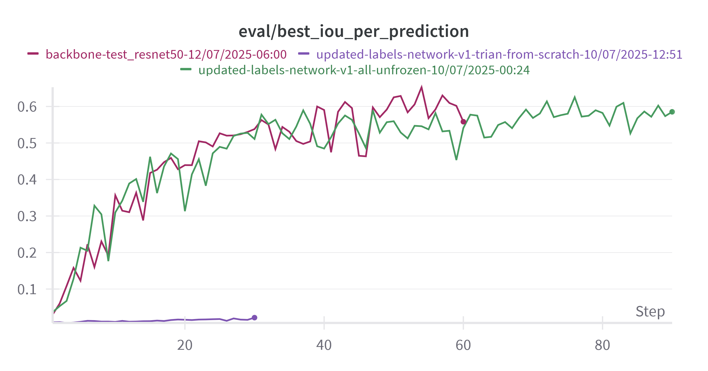
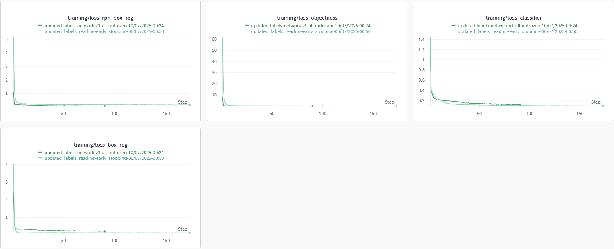

# Model experiments
In this chapter, we describe our approach to identifying an optimal detection architecture for a dataset dominated by numerous small objects. Our entry point was the two-stage Faster R-CNN framework, selected for its modularity and strong track record in general-purpose object detection. From this baseline, we conducted a series of controlled experiments to understand how architectural and training choices impact performance on our problem, inference speed, model complexity and training time. Key factors explored include:
- Backbone variants: We compared different ResNets to assess if smaller backbone networks would be sufficient for our relatively simple images.
- We evaluated both the original Faster R-CNN (“v1”) _[1]_ and its refined “v2” variant _[2][3]_.
- Pretraining and transfer learning: All backbones have the possibility of initializing with ImageNet-pretrained weights, then fine-tuning on our target data if needed.
- Layer freezing strategies: We experimented with different approach to which layers should be frozen and unfrozen to see how it would affect model's performance and training speed.

## Preliminary experiments
### Pretrained weights
The first set of experiments was to establish the importance of using pretrained weights. Since we're using well established network, such as FasterRCNN and even more popular backbone in Resnet we have availability of pretrained weights that could serve as starting point.   

#### Notes 
- Note that in all tests regarding pretrained weights all layers were unfrozen.
- Note that in each of the cases the first layer of the backbone network is swapped out to accomodate for images in our dataset having only 1 channel instead of 3. 
    ```py
    old_conv = model.backbone.body.conv1
    new_conv = nn.Conv2d(1, 64, kernel_size=7, stride=2, padding=3, bias=False)
    # new_conv.weight.data = old_conv.weight.data.mean(dim=1, keepdim=True) # applicable when using pretrianed weights
    model.backbone.body.conv1 = new_conv
    ```

#### Hypothesis
The hypothesis for this set of experiments was that using pretrained weights would impove metrics of the model as well as allow faster convergence of the model enabling us to run more experiments in shorter period of time.

#### Setup
In each of the setups defualt FasterRCNN with ResNet 50 backbone was used. In one experiment we used pretrained weights for the whole network, in another pretrained weights only for the backbone and in the last test we used no pretrained weights at all.   

#### Results
- _backbone-test_resnet50-12/07/2025-06:00_ - only backbone pretrained weights
- _updated-labels-network-v1-trian-from-scratch-10/07/2025-12:51_ - no pretrained weights used
- _updated-labels-network-v1-all-unfrozen-10/07/2025-00:24_ - all available pretrained weights   


  
Model that was not usign any pretrained weights has performed by far the worst being unable to gain any performance in the first 30 epochs besides slight improvement in terms of IoU per ground truth and per prediction. Models using pretrained weights for the backbone only and for the whole network performed very similarly, especially in terms of _map_50_ and best IoU per ground truth.

#### Conclusions
Given obtained results it could be concluded that the most important aspect of the network is using good pretrained weights for the backbone of the model in order to get useful representations out of the image and using pretrained weights for later parts of the network is not as important, however is not harmful either.

### Layer freezing
Having established importance of using pretrained weights, most importantly in the backbone, next set of experiments had to do with how to deal with pretrained backbone. The goal was to compare behaviour of the network during training with the backbone network partially frozen and fully unfrozen.    

#### Hypothesis
The idea with this experiment was to see if it would be enough to use pretrained network and only fine tune later layers or due to the very different nature of the images there would be substantial improvement if all of the layers were unfrozen.

#### Setup
In the partially frozen experiment, only the first layer was unfrozen to accomodate for the fact that our dataset consisted of 1 channel images, compared to RGB (3 channels) images that the ResNets are typically trained with.  

#### Results

  
Training the model with all layers unfrozen has vastly outperformed model with backbone partially frozen in all metrics.

#### Conclusions
Given obtained results, the conclusion has been that given the nature of the images in the dataset being different from images from ImageNet dataset, unfreezing all layers of the backbone is hugely beneficial to the performance of the network by enabling it to learn better representations of the images and thus proposing better bounding boxes.

### Model architecture

# References
1. Ren, S., He, K., Girshick, R., & Sun, J. (2016). Faster R-CNN: Towards Real-Time Object Detection with Region Proposal Networks. arXiv preprint areXiv:1506.01497. https://arxiv.org/abs/1506.01497
2. PyTorch. (n.d.). torchvision.models.detection.fasterrcnn_resnet50_fpn_v2 [Documentation]. Torchvision main documentation. Retrieved July 13, 2025, from https://docs.pytorch.org/vision/main/models/generated/torchvision.models.detection.fasterrcnn_resnet50_fpn_v2.html
3. Li, Y., Xie, S., Chen, X., Dollar, P., He, K., & Girshick, R. (2021). Benchmarking Detection Transfer Learning with Vision Transformers. arXiv preprint arXiv:2111.11429. https://arxiv.org/abs/2111.11429