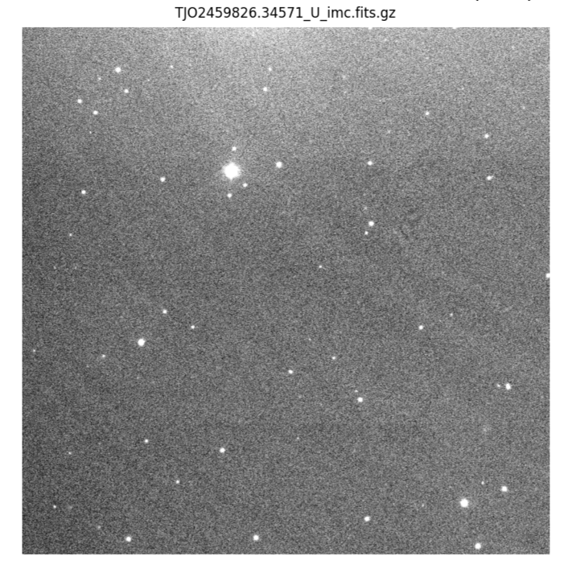
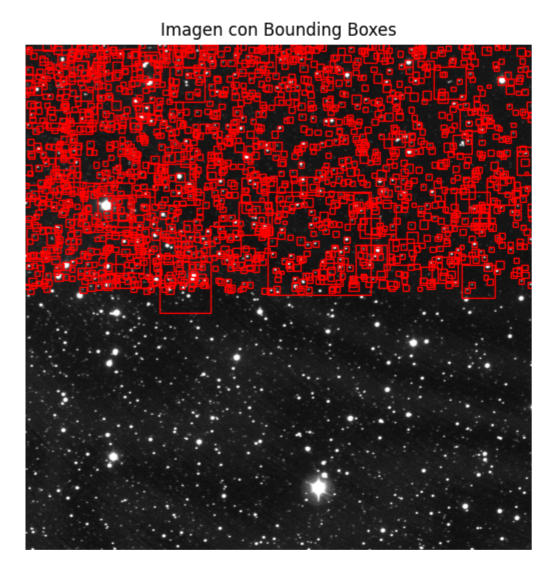
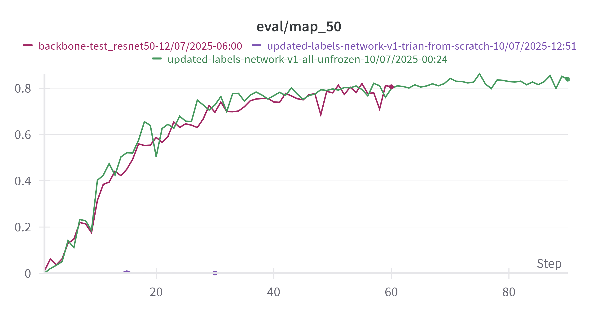
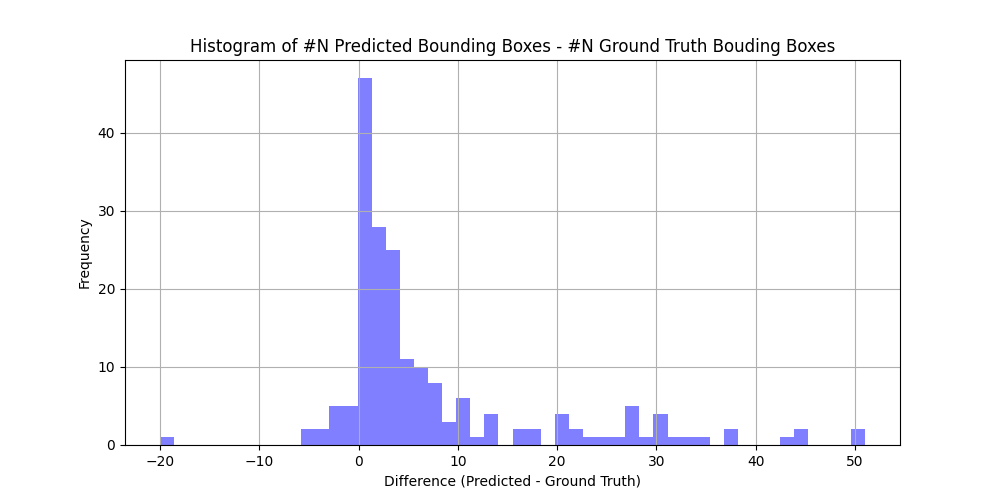

# SAT PROJECT

[**1 INTRODUCTION	2**](#1-introduction)

[1.1 Motivation: PROBLEM TO SOLVE	2](#1.1-motivation:-problem-to-solve)

[2 JOAN ORÓ TELESCOPE DATASET	2](#2-joan-oró-telescope-dataset)

[2.1 Image characteristics	3](#2.1-image-characteristics)

[2.2 Ground truth characteristics	4](#2.2-ground-truth-characteristics)

[2.3 Dataset Preprocessing Procedure	6](#2.3-dataset-preprocessing-procedure)

[2.3.1 Manual cleaning and curation of the dataset	6](#2.3.1-manual-cleaning-and-curation-of-the-dataset)

[2.3.2 Image selection, splitting, and cropping	10](#2.3.2-image-selection,-splitting,-and-cropping)

[**3\. SYSTEM ARCHITECTURE	10**](#4.-system-architecture)

[3.1 Model selection	10](#4.1-model-selection)

[3.2 Adapting RGB pre-trained Models for Monochromatic inputs	13](#4.2-adapting-rgb-pre-trained-models-for-monochromatic-inputs)

[3.3 Fine tuning strategies for specific object detection	13](#4.3-fine-tuning-strategies-for-specific-object-detection)

[3.3 Data augmentation	13](#4.4-data-augmentation)

[3.3 Metrics and loss criterion	13](#heading=h.xdqeqmhe54xo)

[3.4 Checkpoints and Early Stopping	13](#4.6-checkpoints-and-early-stopping)

[3.1 Main Hyperparameters	14](#4.7-main-hyperparameters)

[3.5 Working Environment	14](#heading=h.8ha8vao109aq)

[**4\. Variations and experiments	14**](#5.-experiments)

[4.3 Hyperparameter search experiments	14](#5.2-hyperparameter-search-experiment)

[**4\. Results	17**](#6.-results)

[4.1 Model comparison	17](#6.1-model-comparison)

[Best performance	17](#best-performance)

[Experiments that have been run	17](#heading=h.uomqm1h8tdzf)

[4.2 Effect of Non Maximum Suppression Threshold on Object Detection	17](#6.2-effect-of-non-maximum-suppression-threshold-on-object-detection)

[4\. Modifications implemented to the models / Special Techniques	18](#4.-modifications-implemented-to-the-models-/-special-techniques)

[5\. Inference and Validation	18](#5.-inference-and-validation)

[**CONCLUSIONS	19**](#conclusions)

[**Future improvements	19**](#future-improvements)

[Index	19](#index)

[**Bibliography	22**](#bibliography)

# 

# 1 Introduction

## 1.1 Motivation: Problem to solve

We have used Artificial Intelligence and DL algorithms to solve the problem of **automatic detection of relevant astrophysical objects (such as stars, galaxies, or cosmic structures)** in telescope images from Joan Oró in the Montsec Observatory \[ref 1\] — a task that is **highly challenging due to the variability, noise, and complexity of the data**.

Traditional methods or rule-based systems fail to generalize across different kinds of images, especially when faced with:

* Instrumental noise (e.g., traces, bright spots, edge artifacts),  
* Inconsistent annotations or missing metadata,  
* Overlapping or barely visible objects.

Using **deep learning object detection models** (Faster R-CNN with ResNet backbones), we developed and trained a system capable of:

* Learning complex visual patterns from astronomical data,  
* Generalizing detection across varied image conditions,  
* Evaluating predictions using robust metrics (mAP, IoU),  
* Automatically adjusting to different detection thresholds (via NMS and hyperparameter tuning).

# 2 Joan Oró Telescope Dataset

The Team has worked with a set of **astronomical images**, both **raw** and **pre-processed**, with the goal of detecting **relevant astrophysical objects**, such as **stars**, **galaxies**, or other celestial bodies.

The dataset has two big blocks: the *.fits* images and the ground truth, which is a file with *.dat* extension. As it is stated in the bibliography \[ref 2\], fits images are very heavy to manage in ram memory during execution.

## 2.1 Image characteristics

* **Duplicated images** that were not properly detected by filename but could be identified through content or metadata.  
* **High variability** in the appearance of these objects: they can differ greatly in **shape**, **brightness**, **size**, and **contrast**.

* The presence of **shiny artifacts**, **diffraction patterns**, and **instrumental noise**, which can mislead detection models.

* The complexity of differentiating between background noise and actual relevant objects.

* Some images are particularly challenging — we refer to them as the "**difficult ones**" — where standard detection techniques fail or produce unreliable results.

Examples of defects and **variability** of the data:

| A satellite can be detected | Depending on the readout, different regions of the detector can have different biases | Example of fringes due to illumination in the background or filter defect | Examples of fringes II |
|:----------------------------:|:--------------------------------------------------------:|:--------------------------------------------------------------:|:---------------------:|
|  |  |  |  |


Different illumination patterns and “contrast” between images due to different exposition time, different filters and different background illumination (sky luminosity counts). If the moon is near, or the object is near the twilight it can affect the background counts.

| Saturated objects may appear | Gradient in the background illumination | A trace from a comet | A galaxy with high ellipticity |
|:-----------------------------:|:----------------------------------------:|:---------------------:|:-----------------------------:|
|  |  |  |  |


| A big galaxy with high ellipticity and different sizes | A big galaxy with high ellipticity and different sizes | Different background and appearance of the object due to the use of two different filters | Different background and appearance of the object due to the use of two different filters |
|:------------------------------------------------------:|:------------------------------------------------------:|:------------------------------------------------------------------------------------------:|:------------------------------------------------------------------------------------------:|
|  |  |  |  |


## 2.2 Ground truth characteristics

After the observation campaign in the telescope, images are processed with a professional pipeline in the telescope and every image acquires (or should be paired to) its catalogue, a .dat file that is saved together with the image and will be provided later as a dataset. 

![][image11]

This catalogue has astronomical information about the observed objects such as luminosity, position in the sky, ellipticity of the objects, , and other astrophysical features. As other telescopes over the world, it follows the unified sextractor format \[ref 3\]. However, there are some potential issues related to this file when handling a huge amount of data:

**Incorrect or incomplete annotations**, including:

1. Images without catalogs, or with empty or inconsistent catalogs.  
2. Poorly defined bounding boxes, especially for medium and large objects.  
3. **Mismanaged or missing metadata**, which prevented automation of tasks such as duplicate detection and **labels with semantic or spatial errors**, which negatively impacted training and metric evaluation.

| Example of issue 2) | Example of issue 2) | Example of issue 3) |
|:-------------------:|:-------------------:|:-------------------:|
|  |  |  |


## 2.3 Dataset Preprocessing Procedure

### 2.3.1 Manual cleaning and curation of the dataset

Taking into account the previous issues a pre-processing of the data was done a manual clearing and curation of the dataset.

* Individual review of hundreds of images to label the images.  
* Identification of duplicates using metadata and visual content.  
* Correction or removal of faulty bounding boxes.  
* Skip objects that saturate the detector and cannot be considered ***relevant objects*** or ***scientific objects,*** which will be labelled as ESO (example of saturated object).

Examples of the labels linked to the image files after a 1 by 1 inspection of the images:


<table>
  <tr>
    <th style="text-align:center">ESO, example of a saturated object</th>
    <th style="text-align:center">Profiles of the normalized flux</th>
  </tr>
  <tr>
    <td style="vertical-align:top; text-align:center">
      
    </td>
    <td style="vertical-align:top; text-align:center">
      <br/>
      
    </td>
  </tr>
</table>

In the following table labels are summarized to illustrate variability of the data. 

| ESO, COMET | TRACE | GALAXY | ESO |
|:----------:|:-----:|:------:|:---:|
|  |  |  |  |
|  |  |  |  |


| BINARY | LIGHT |
| :---- | :---- |
|  |  |

This processing gives as a result a generation of a **clean, high-quality dataset** with [labels associated to the file](https://drive.google.com/drive/folders/1bJ2Juznn3Gzg7jkGEJmCCFB1bcMXFdFk?usp=drive_link), in order to filter datasets and being able to generate controlled and labelled ground truth to perform the experiments:

![][media/label_file.png] 

In the following graph, the variance of the images is summarized ([script](https://colab.research.google.com/drive/1Zildsp_DplN5QcJmf9-2w8AyHPB6686q?usp=drive_link)):


In order to **just take into account images with relevant objects** we only include in the model exploration and training a clean dataset. To do so, [some datasets were prepared](https://colab.research.google.com/drive/1r49XJp1SminHT5qjxWdTCSZ7A8Eq813h?usp=drive_link), selecting the labels OK, OK and ESO among the 1000 images that were obtained by Joan Oro's telescope repository. 

The model of this project has been trained with a [dataset of 299 images](https://colab.research.google.com/drive/1r49XJp1SminHT5qjxWdTCSZ7A8Eq813h?usp=drive_link) with reliable labels such as this image and to generate it we have filtered the images with no saturated objects and no weird features excluding galaxies, comets, or binary systems to make sure that the model learn how to differentiate a star from the background, and so, is capable to detect **relevant objects**.

| Example 1 | Example 2 | Example 3 | Example 4 |
|:---------:|:---------:|:---------:|:---------:|
|  |  |  |  |

**Figura**: Ejemplos de cómo se han ajustado las *bounding boxes* sobre los objetos astronómicos para el entrenamiento del modelo de detección.


Even though the dataset has been reduced to retain only reliable labels, there are still plenty of extreme outliers that heavily skew the data. The diagrams below show histograms and boxplots of object sizes with and without outliers

   
In both cases it can be seen that there are extreme outliers heavily skewing the data beyond it’s otherwise close to normal distribution.

### 2.3.2 Image selection, splitting, and cropping

In the cleaned dataset the average size of an object is 319.46 pixels² which gives an average ratio of object to the image of 0.00001899 with around 345 objects per image on average. In order to reduce computation resources, as well as reduce the number of objects per image and increase the relative size of objects to the image, the images are split into 512x512 pixel images (configurable), and information on the cropping coordinates is added to the product metadata. A “cropped” version of the ground truth is also generated including only the entries in the cropped region, removing any position offset. If no entries are available at a given crop, neither the cropped image or the cropped ground truth are saved. Such cropping should not negatively affect the information in the image since the objects themselves are not affected by the global context and are relevant only in their local surroundings.

After this operation the average size of an object stays nearly the same at 319.48 pixels² (difference most likely coming from edge cases handling), however the average ratio of an object to an image increases to 0.00121871 and the average number of objects per image drops down to around 48.

In case any image is found without ground truth, it is set apart from the training dataset, so they still can be used for inference. Right after, the images are hard splitted as 81% train, 9% validation, and 10% test. After the hard cropping, a total of 1728 images were generated for training, 192 for validation, and 187 for test. Note that these numbers do not match the percentages mentioned above because the crops removed for lacking objects inside.


# 3 Working environment
The project was developed on local machines. Training and experiments were done using both local consumer machines with GPU RTX 4070 Ti and GPU NVIDIA GeForce RTX 4070 Ti Supe (respectively), Google Colab and Google Compute Engine to be able to use more powerful machines and perform different experiments in parallel.

Wandb was used for logging purposes. Train runs by default are logged to common wandb project where they can be inspected and compared. 

# 4 System architecture

## 4.1 Model selection

The goal is to explore how modern deep learning techniques could be applied to astronomical analysis. Given that the available data consists primarily of 2D monochromatic images from telescopes, it was natural to focus on convolutional neural networks and other architectures designed to process visual inputs. To guide this selection, we reviewed both general-purpose object detection architectures and domain-specific models reported in the literature. A large part of this benchmarking effort was informed by the comprehensive literature review presented in Radio Astronomical Images Object Detection and Segmentation: A Benchmark on Deep Learning Methods \[3\], as well as insights drawn from individual studies such as Mask Galaxy: Morphological Segmentation of Galaxies \[4\]. The benchmarking process grouped models into the following main categories:

* Two-stage detectors: Two-stage models first generate candidate regions where objects might be, and then classify each region and refine its position. Examples include:  
  * Fast R-CNN, which uses a CNN backbone (e.g., VGG16) to extract features from the entire image. Then, it applies Region of Interest (ROI) pooling to extract features from proposed object regions. However, these proposals come from an external algorithm, usually Selective Search, which is not part of the neural network and doesn’t learn from the data.   
  * Faster R-CNN removes this bottleneck by introducing a Region Proposal Network (RPN), a lightweight CNN that slides over the feature map and proposes regions likely to contain objects. This makes the model end-to-end trainable. Additionally, it often uses a Feature Pyramid Network (FPN) as a backbone. FPNs build multi-scale feature maps, allowing the network to detect objects of different sizes, a key benefit for astronomy, where stars and galaxies can appear at vastly different scales.  
  * Mask R-CNN builds directly on Faster R-CNN. It adds a third output branch to the architecture: a segmentation, enabling pixel-level instance segmentation. It also improves how features are extracted from regions using RoIAlign, a refinement over ROI that helps preserving spatial accuracy, an important improvement for scientific images where precision matters.  
* One-stage detectors:  One-stage models detect and classify objects in a single pass, without a separate region proposal step, making them faster but sometimes less precise than two-stage models. In these architectures, the entire image is processed at once,  
  * YOLO (You Only Look Once): Divides the image into a grid and lets each grid cell predict bounding boxes and class probabilities. It’s extremely but may struggle with very small or overlapping objects.  
  * Single Shot MultiBox Detector (SSD): Improves on YOLO by using multiple feature maps at different resolutions, allowing better detection of both small and large objects.  
  * RetinaNet: Builds on SSD with a stronger backbone and introduces focal loss, a technique that reduces the influence of easy background examples and focuses the training on harder, less frequent objects, particularly useful for datasets with high class imbalance, like astronomical images where most pixels are background.  
  * EfficientDet: Prioritizes model efficiency by using a bi-directional Feature Pyramid Network (BiFPN), which allows the model to combine information from both shallow and deep layers. Additionally, it uses compound scaling, a technique that jointly scales the model’s depth, width, and input resolution in a balanced manner.   
* Domain-specific models. Several models have been specifically designed or adapted for astronomical image analysis  
  * AstroYOLO: Adaptation of YOLO for astronomical surveys.  
  * PSDetNet, which is designed for the detection of point sources — such as stars — in particularly noisy environments, which are common in deep-sky or radio observations.  
  * PI-AstroDeconv is a model designed to detect very faint or blurred objects in astronomical images. It integrates PSF deconvolution, a process that corrects image distortion caused by telescopes or the atmosphere, directly into the network.   
  * Mask R-CNN (galaxy-focused) has been successfully applied to tasks such as galaxy segmentation and morphological classification.  
* Transformer-based detectors: Transformer-based models, originally models developed for natural language processing, have ability to capture global relationships in an image, meaning they can understand how different parts of an image relate to each other, even if they are far apart.  These models show promising results, particularly in complex spatial contexts. However, the high computational cost and training complexity make them more suitable for future work than for current baseline evaluations. Some examples are:   
  * DETR (Detection Transformer) combines a CNN backbone (for extracting visual features) with a transformer encoder-decoder, allowing the model to directly predict object positions and classes without needing anchor boxes or region proposals. It’s particularly effective at detecting overlapping or irregular objects but it requires significant computational resources. STAR-DETR is a specialized version of DETR, optimized for detecting space-related targets, such as satellites or objects in low-Earth orbit.  
  * RelationNet adds a transformer-like module between the feature extractor and the prediction layers, allowing the model to "look at" multiple regions at once and learn how they influence each other.

After evaluating a wide range of models, Faster R-CNN was selected as the architecture for this project. This choice was guided primarily by academic considerations, as this model had been studied and implemented in the context of our coursework, which makes this model a pedagogically sound option. Models based on transformers and one-stage detectors were not selected due to task-specific constraints. Transformer-based models come with a high computational cost, leading in high training times to perform well. One-stage detectors offer high inference speed and are suitable for real-time applications, but this is not a critical requirement in our astronomical task, where accuracy is prioritized over speed.   
We acknowledge that in a professional setting, the choice of Faster R-CNN would benefit from further refinement. Several models specifically designed for astronomical applications, such as AstroYOLO, PSDetNet, or Pi-AstroDeconv (as explained before) have shown promising performance in recent literature. In this sense, the selection of Faster R-CNN should be viewed as a solid academic baseline rather than an optimal solution.   
That said, Faster R-CNN is a robust and flexible architecture and it has also been successfully adopted in published astronomical research. For instance, CLARAN (Wu et al., 2018\) \[1\] applies a Faster R-CNN variant to classify complex radio morphologies, while Burke et al. (2019) \[2\] use a Mask R-CNN (built on Faster R-CNN) for deblending and classifying blended sources in deep-sky surveys. These examples demonstrate that, despite being a general-purpose model, Faster R-CNN remains competitive choice for object detection and segmentation in astronomy

## 4.2 Adapting RGB pre-trained Models for Monochromatic inputs

Object detection models are generally trained with general purpose RGB images. However, the telescope images are monochromatic and might not even be in the Red, Green or Blue channels. Several techniques can be applied to adapt a RGB network to a monochromatic image:

* Replicating 3 times the original image to have a 3 channel image.  
* Modify the input CNN to have 1 input and use as weights the average of the original 3-channel input CNN.  
* Modify the input CNN to have 1 input, randomly initialize the weights, and train it from scratch during fine tuning. 

## 4.3 Fine tuning strategies for specific object detection

Pretrained object detection networks are trained with a wide variety of objects. Their use for specific categories of objects (such as celestial bodies) require fine tuning, even more if the goal is to differentiate between objects that are so similar (the difference between a galaxy and a star is small compared to the difference of a cat and a car).

Reducing the number of layers might seem a logical decision since the objects have low complexity (white dots or ellipsoids in an almost black background), so the network becomes lighter and faster to train. However, the difference between a star and a galaxy might be encoded in deeper and more abstract features \[Min, 2022\], and therefore it might be a counterproductive decision.

Fine tuning strategies might include:

* Selective Parameter-Efficient Fine-Tuning, or partial fine tuning, which trains only part of the layers of the model, typically the latest ones, freezing the backbone. A variation includes the Dynamic Backbone Freezing, which freezes and unfreezes alternately the backbone during the training stage. This technique allows to preserve low-level generic features and to include new specific features.  
* Additive Parameter-Efficient Fine-Tuning, which introduces bottleneck layers in the pretrained model, and only these layers are trained.  
* Reparametrization using techniques such as Low-Rank Adaptation, that allow to represent the current parameters into a lower dimensional form so to find which parameters need to be retuned, reducing the number of parameters to be retuned up to 99% \[Zhang, 2025\].  
  
## 4.4 Data augmentation

Data augmentation is conducted using the Albumentations library, which allows to crop, rotate, zoom, etc. not only images, but also bounding boxes and masks. The library can also discard invalid bounding boxes (those out of a cropping, for instance).

For data augmentation, originally images were cropped to get 1 image of 512x512 pixels ensuring at least one bounding box,, and  then randomly rotated from 0º to 270º in steps of 90º. After many images were discarded from manual filtering, the images were hard cropped into subimages of 512x512 to overcome the drastic decrease of useful data.


## 4.6 Checkpoints and Early Stopping

* **Checkpoints & Early Stopping**

  * Implemented checkpoint saving
  * Considered early stopping (optional, based on wandb config)  
  * 

## 4.7 Main Hyperparameters

* `batch_size`: \[4, 8, 16\]
* `learning_rate`: log-uniform \[1e-6 to 1e-2\]
* `early_stopping_patience`: \[0, 3, 5\]
* `weight_decay`: \[1e-5, 1e-4, 1e-2\]

## 4.8 Other Modifications implemented to the models

Faster R-CNN has a default maximum number of objects per image to 100, which was set to 1000 since some 512x512 crops contained more than 200 using the input parameter:

```py
box_detections_per_img=1000
```

# 5 Loss criterion and evaluation metrics
## 5.1 Loss criterion
In this chapter, we introduce the concept of a loss criterion as the guiding signal that steers an object‐detection model toward better performance. At its core, a loss function measures the gap between the model’s predictions (both “what” is in the image and “where” it is) and the ground‐truth annotations. By assigning a numerical penalty to errors in classification and localization, the loss criterion translates raw mistakes into gradients that update the network’s weights.   

Loss calculation is handled by FasterRCNN internals out of the box without any particular changes for the purposes of this project.

### loss_rpn_box_reg
Measures how well the RPN’s proposed anchors are localized (i.e. shifted and scaled) to better fit ground-truth boxes. Calculated using smooth L1 loss

$$
\ell = 0.5(x-y)^2,\ if\ |x-y|\lt1\ \\
$$
$$
\ell = |x-y|-0.5, \ otherwise
$$

### loss_objectness
Measures how well the RPN (Region Proposal Network) distinguishes “object” vs. “background” for each anchor. Calculated using binary cross-entropy on each anchor’s predicted objectness score 

$$
\ell​=−\frac{1}{N}\sum_{i=1}^{N}[y\log{p}+(1−y)\log{(1−p)}]
$$

### loss_classifier
Measures how well the final detection head assigns each proposed RoI to one of the KK object classes (or background). Calculated using multiclass cross-entropy over $K+1$ outputs (one per class plus background)

$$
\ell = -\sum_{c=0}^{K} \mathbf{1}\{c = c^*\}\,\log p_{c}
$$

### loss_box_reg
Measures how accurately the final head refines each positive RoI’s box to match the ground-truth. Calculated by using smooth L1 loss on the 4-parameter offsets for the correct class of each positive RoI.  

$$
\ell = \sum_{i\in{x,y,w,h}}​smooth_{L_{1}}​(t_{i}​−t_{i}^{∗}​)
$$

## 5.2 Evaluation metrics
In this chapter, we introduce the key metrics that have been used to assess the performance of our object detection network and. In object detection, metrics should focus on both the proper alignment of predicted bounding boxes relative to the ground truth and the correct classification of objects. The latter challenge is simplified in this project, as the problem has been reduced from a multi-class to a single-class scenario, defining only background and object-of-interest categories.

We utilize the `torchmetrics` package to ensure consistency and reproducibility, minimize development time, and delegate edge-case handling to well-tested implementations. This approach provides easy access to object detection and classification metrics, such as Intersection over Union (IoU), precision, and recall.

### 5.2.1 Metrics rundown
Using `MeanAveragePrecision` and `intersection_over_union` the following metrics are calculated to evaluate performance of the model. 

#### 5.2.1.1 IoU related metrics
Intersection over Union (IoU) metrics quantify the degree of overlap between predicted and ground truth bounding boxes. IoU itself yields a quantitative measure of how closely the model’s predicted box matches the true object position. A larger IoU value reflects tighter overlap between the prediction and ground-truth box, indicating more accurate localization. The `intersection_over_union` function computes the IoU between each pair of predicted and ground truth boxes. In particular:
```py
intersection_over_union(pred["boxes"], target["boxes"], aggregate=False)
```
returns `N x M` matrix of IoU scores where `N` is the number of predicted boxes and `M` is the number of target boxes such that each entry (i, j) is   

$$
\mathrm{IoU_{ij}} = \frac{area(\;pred_{\text{i}}\;\cap\; gt_{\text{j}})}{area(\;pred_{\text{i}} \;\cup\; gt_{\text{j}})}
$$

where
- $pred_{\mathrm{i}}$ is the $i$-th predicted bounding box
- $gt_{\mathrm{j}}$ is the $j$-th ground-truth bounding box
- $\cap$ denotes the geometric intersection of the two boxes
- $\cup$ denotes their union
- $area()$ indicates the area of the region


Using the matrix described above, we focus on the following 2 metrics

##### best_iou_per_gt

The `best_iou_per_gt` metric measures, for each ground-truth box, the highest IoU achieved by any predicted box and then averages these maxima across all ground-truths. Concretely, for each ground-truth in a batch we take the max over the IoU matrix’s columns (`iou.max(dim=0)`), concatenate these values, and compute the mean—yielding a single value that reflects how well the model covers true objects on average. This behavior is analogous to recall, since it indicates the degree to which real objects are met by at least one prediction, but it operates as a continuous, threshold-free measure of localization quality.

##### best_iou_per_prediction

The `best_iou_per_prediction` metric quantifies, for each predicted box, the highest IoU with any ground-truth box, then averages these values across all predictions. Practically, we take the max over the IoU matrix’s rows (`iou.max(dim=1)`), aggregate them over the batch, and compute the mean—providing insight into how precisely the model’s detections align with actual objects. This mirrors precision, as it reflects how many predictions are accurate, yet it remains a soft measure of overlap without requiring an IoU threshold to binarize true positives.

#### 5.2.1.2 Precision and recall related metrics

Mean Average Precision (mAP) and Mean Average Recall (mAR) extend IoU-based evaluation to capture both the trade-off between false positives and true positives and the model’s ability to find all objects. Using `torchmetrics.detection.mean_ap.MeanAveragePrecision`, predictions and ground-truths are aggregated to compute metrics at multiple IoU thresholds (by default COCO’s from 0.50 to 0.95 with step of 0.05). Mean Average Recall (mAR) is similarly derived by measuring recall at fixed numbers of detections per image (e.g., 1, 10, 100) across the same IoU thresholds and averaging it. Precision together with Recall describe the model’s effectiveness at producing correct positive detections and at identifying all true objects.

##### Precision
Precision is a key evaluation metric that measures the correctness of the model’s positive predictions by determining the proportion of true objects among all detected ones. It reflects the model’s effectiveness at filtering out false positives—higher precision implies the model makes confident, trustworthy detections with few incorrect alarms.

$$
precision = \frac{TP}{TP + FP}
$$

By using torchmetrics’ implementation of `MeanAveragePrecision`, we get mAP at different IoU thresholds, in particular at 50, 75, and the average of all thresholds, as well as for different object sizes, however, due to the dataset’s nature, where the overwhelming number of objects are very small, we mostly ignore those metrics.

##### Recall
Recall, also called sensitivity or the true positive rate, is a metric used for gauging a model’s performance, particularly in object detection. It quantifies the model’s ability to find every relevant object in an image, effectively measuring how comprehensive its detections are. A high recall score means the model succeeds at detecting the vast majority of true objects with few misses.

$$
recall = \frac{TP}{TP + FN}
$$

Similarly to precision, by using torchmetrics’ solution, we get mAR at different detection thresholds (defined by maximum number of detected objects). We define it as three equal steps from the maximum detections per image, where the maximum is predefined as a hyperparameter. Also, similarly to precision, we get recall at different object sizes, however, we ignore those metrics.

### 5.2.2 Key metric
The key metric selected for this project has been mAP at 0.5 IoU threshold. This threshold ensures detected boxes match the objects of genuine scientific interest without imposing overly restrictive requirements, as it allows for minor localization variance while requiring meaningful overlap. By focusing on mAP at 0.5 threshold, we also reduce sensitivity to annotation inconsistencies described in the previous section so that our evaluation reflects true detection capability instead of artifacts arising from imperfect labels.

# 6 Model experiments
In this chapter, we describe our approach to identifying an optimal detection architecture for a dataset dominated by numerous small objects. Our entry point was the two-stage Faster R-CNN framework, selected for its modularity and strong track record in general-purpose object detection. From this baseline, we conducted a series of controlled experiments to understand how architectural and training choices impact performance on our problem, inference speed, model complexity and training time. Key factors explored include:
- Backbone variants: We compared different ResNets to assess if smaller backbone networks would be sufficient for our relatively simple images.
- We evaluated both the original Faster R-CNN (“v1”) and its refined “v2” variant.
- Pretraining and transfer learning: All backbones have the possibility of initializing with ImageNet-pretrained weights, then fine-tuning on our target data if needed.
- Layer freezing strategies: We experimented with different approach to which layers should be frozen and unfrozen to see how it would affect model's performance and training speed.

## 6.1 Pretrained weights
The first set of experiments was to establish the importance of using pretrained weights. Since we're using well established network, such as FasterRCNN and even more popular backbone in Resnet we have availability of pretrained weights that could serve as starting point.   

### 6.1.1 Notes 
- Note that in all tests regarding pretrained weights all layers were unfrozen.
- Note that in each of the cases the first layer of the backbone network is swapped out to accomodate for images in our dataset having only 1 channel instead of 3. 
    ```py
    old_conv = model.backbone.body.conv1
    new_conv = nn.Conv2d(1, 64, kernel_size=7, stride=2, padding=3, bias=False)
    # new_conv.weight.data = old_conv.weight.data.mean(dim=1, keepdim=True) # applicable when using pretrianed weights
    model.backbone.body.conv1 = new_conv
    ```
- Similarly the box predictor is swapped out to accomodate for different number of classes in our dataset compared to the original ImageNet dataset (2 classes in our case; object of interest and background).
    ```py
    FastRCNNPredictor(in_features, 2) # object of interest + background
    ```
    in particular this means that even in cases of loading pretrained weights for the whole network the box predictor is initialised without any weights since it needs to be set up for the correct number of classes.

### 6.1.2 Hypothesis
The hypothesis for this set of experiments was that using pretrained weights would impove metrics of the model as well as allow faster convergence of the model enabling us to run more experiments in shorter period of time.

### 6.1.3 Setup
In each of the setups defualt FasterRCNN with ResNet 50 backbone was used. In one experiment we used pretrained weights for the whole network, in another pretrained weights only for the backbone and in the last test we used no pretrained weights at all.   

### 6.1.4 Results
- _backbone-test_resnet50-12/07/2025-06:00_ - only backbone pretrained weights
- _updated-labels-network-v1-trian-from-scratch-10/07/2025-12:51_ - no pretrained weights used
- _updated-labels-network-v1-all-unfrozen-10/07/2025-00:24_ - all available pretrained weights   


  
Model that was not usign any pretrained weights has performed by far the worst being unable to gain any performance in the first 30 epochs besides slight improvement in terms of IoU per ground truth and per prediction. Models using pretrained weights for the backbone only and for the whole network performed very similarly, especially in terms of _map_50_ and best IoU per ground truth.

### 6.1.5 Conclusions
Given obtained results it could be concluded that the most important aspect of the network is using good pretrained weights for the backbone of the model in order to get useful representations out of the image and using pretrained weights for later parts of the network is not as important, however is not harmful either.

## 6.2 Layer freezing
Having established importance of using pretrained weights, most importantly in the backbone, next set of experiments had to do with how to deal with pretrained backbone. The goal was to compare behaviour of the network during training with the backbone network partially frozen and fully unfrozen.    

### 6.2.1 Hypothesis
The idea with this experiment was to see if it would be enough to use pretrained network and only fine tune later layers or due to the very different nature of the images there would be substantial improvement if all of the layers were unfrozen.

### 6.2.2 Setup
In the partially frozen experiment, only the first layer was unfrozen to accomodate for the fact that our dataset consisted of 1 channel images, compared to RGB (3 channels) images that the ResNets are typically trained with.  

### 6.2.3 Results

  
Training the model with all layers unfrozen has vastly outperformed model with backbone partially frozen in all metrics.

### 6.2.4 Conclusions
Given obtained results, the conclusion has been that given the nature of the images in the dataset being different from images from ImageNet dataset, unfreezing all layers of the backbone is hugely beneficial to the performance of the network by enabling it to learn better representations of the images and thus proposing better bounding boxes.

## 6.3 Backbone architecture
In this stage of experiments we explore backbone architecture choices among different ResNets. We tested networks of varying depth, all initialized with weights pretrained on ImagNet, while noting that not all of tested variants provided pretrained weights for the full detection network. We then evaluate how differences in depth and feature map resolution affect the model’s ability to locate small objects and its overall processing speed.  

### 6.3.1 ResNet architecture
ResNet is a deep convolutional network architecture that introduces residual, or skip, connections to help train very deep models. In each residual block the input is added directly to the output of a few stacked convolutional layers, letting the network learn only the “residual” needed to improve performance. This design mitigates vanishing‐gradient issues and allows networks with dozens or even hundreds of layers to converge faster and achieve higher accuracy.  

Below diagram depicts ResNet block and ResNet(18) architecture
   
By configuring different numbers of channels and residual blocks in the module, we can create different ResNet models, such as the deeper 152-layer ResNet-152

### 6.3.2 Hypothesis
The goal fo this experiment was to verify if, given relatively simple images as shown in previous chapters, smaller ResNet would be sufficient for solving the problem.

### 6.3.3 Setup
FasterRCNN network would be trained for limited number of epochs (60 epochs, down from default 200, both cases using early stopping mechanisms) with different ResNets, ResNet18, ResNet34, ResNet50 and ResNet101 _[4]_. In all cases ResNet backbone would be initialised with pretrained weights whereas the rest of the network would have default weights.

### 6.3.4 Results
  
  
Considering _mAP_50_ metric, ResNet18 has performed worse than other networks, whereas ResNets34, 50 and 101 have performed at similar levels without any advantages of one over the others. 

| backbone ResNet     | Number of parameters (total) |
|------------|----------------------|
| ResNet18  | 28.27 M               |
| ResNet34 | 38.37 M               |
| ResNet50 | 41.29 M               |
| ResNet101 | 60.23 M               |

### 6.3.5 Conclusions
In practice it has been experienced that ResNet18 has performed worse than other networks even tho the images are relatively simple. It has also been observed that increasing the size of the network beyond ResNet34 doesn't necessarily yield noticeably better results on the validation metrics.  
Due to availability of weights for the whole network with ResNet50 it has been decided to proceed with that network in spite of there seemingly being 

## 6.4 FasterRCNN v1 vs v2 (`fasterrcnn_resnet50_fpn_v2`)
In this stage we compare the original Faster RCNN implementation (v1) against its refined iteration (v2) to see if there would be benefits for our problem from using v2 version. Importantly, there are available weights for pretrained network with ResNet50 backbone.   
Main differences in the v2 implementation used in this in project is addition of extra convolutional layer in RPNHead before final objectness‐score and box‐regression convolutions giving and different implementation of Box head, which is a network that takes each RoI’s pooled feature map and turns it into a fixed-length vector representation for downstream classification and bounding-box regression. In particular in v1 verison the network is simpler, having just two fully connected layers whereas in v2 we use more complex network with convolutional layers that is followed by fully connected layers which potentially gives more spatial processing to the box head.

### 6.4.1 Hypothesis
Given more complex network the goal of the experiment was to verify if it would improve performance of the network with respect to _mAP_50_ metric. 

### 6.4.2 Setup
In this experiment both networks were trained using ResNet50 backbone and pretrained weights for the whole network for both v1 and v2 cases (`https://download.pytorch.org/models/fasterrcnn_resnet50_fpn_coco-258fb6c6.pth` and `https://download.pytorch.org/models/fasterrcnn_resnet50_fpn_v2_coco-dd69338a.pth` respectively).

### 6.4.3 Results
   
The main apparent difference between using v2 model instead of v1 according to the experimet is that the v2 model achieves higher results faster than the v1 counterpart. The final difference between max _mAP_50_ between both models was $0.87$ for v2 and $0.862$ for v1, however v1 model needed 75 epochs whereas v2 model achieved $0.87$ _mAP_50_ in 30 epochs.  
Even though it took less epochs for for the v2 model to achieve high metric reuslt, the time was similar due to increased complexity of the v2 model and thus each epoch taking longer to train.

| Network     | Number of parameters (total) |
|------------|----------------------|
| ResNet50, v1 | 41.29 M               |
| ResNet50, v2  | 43.25 M               |

### 6.4.4 Conclusions
According to the experiment the v2 model does give a boost in performance compared to the v1 model, it also seems to converge faster (in terms of epochs) at the cost of each epoch being more costly in terms of time.


## 6.5 Effect of Non Maximum Suppression Threshold on Object Detection

The Non-Maximum Suppresion (NMS) algorithm threshold is responsible for reducing the number of regions of interest proposed by the region proposal network. The algorithm is based on the Intersection over Union metric (IoU) as the intersection of two bounding boxes divided by their union. If the value is over the given threshold (0.5 by default), the two boxes are considered to be covering the same object, and the smaller one is chosen. The threshold can be changed by modifying the variable:

```py
model.roi_heads.nms_thresh 
```
If objects tend to be too close, the NMS algorithm might propose just one region for the two objects. Furthermore, experiments in this project showed that noisier images tend to show more proposed ROIs over the same object, so the NMS threshold should be adjusted.

### 6.5.1 Hypothesis

Reducing the threshold implies that less overlapping is required to reduce two bounding boxes. There will be less duplicated boxes but we risk to miss objects close together.

### 6.5.2 Setup

The v2 network with ResNet50 is used. To visualize the effect of non-maximum suppression in the telescope images, the test dataset is analyzed with 5 NMS threshold values (0.3, 0.4, 0.5, 0.6 and 0.7). Metrics are computed for all 5 cases, and figures are plot for cases 0.3, 0.5 and 0.7. 

### 6.5.3 Results

In the following noisy image, it can be seen how by increasing the NMS threshold increases the number of predictions in the same object, clearly seen in the object clusters at (x,y) \~ (110,50), (250, 0), and (500, 0).
<figure>
  <div align="center">
    
  </div>
  <figcaption align="center">From left to right, NMS threshold = 0.3, 0.5, and 0.7, respectively. Check the object cluster at (x,y) \~ (110,50) Bottom-Left, (250, 0) Bottom-Center, and (500, 0) Bottom-Right.</figcaption>
</figure>


The following example, less noisier, also shows how reducing the NMS threshold results in less redundant objects detected, such as in (x,y) \~ (220, 480) Top-Center, or in (450,25) Bottom-Right.

<figure>
  <div align="center">
    
  </div>
  <figcaption align="center">From left to right, NMS threshold = 0.3, 0.5, and 0.7, respectively. Check the object cluster at (x,y) \~ (220, 480) or in (450,25).</figcaption>
</figure>


| NMS Threshold | mAP@50 | best_iou_per_gt | best_iou_per_prediction |
|:-----------------:|:-----------------:|:-----------------:|:-----------------:|
| 0.3    | 0.8878    | 0.7563    |0.6412    |
| 0.4    | 0.8945    | 0.7592    |0.6279    |
| 0.5    | 0.8927    | 0.7625    |0.6152    |
| 0.6    | 0.8967    | 0.7649    |0.6005    |
| 0.7    | 0.8893   | 0.7677    |0.5799    |

The results show that the mAP@50 has a peak value between 0.5 and 0.7. best_iou_per_gt, which behaves analogously to recall, increases as NMS Threshold increases; that is, it indicates that the degree to which real objects are met by at least one prediction increases as more bounding boxes are present. On the contrary, best_iou_per_prediction, which behaves analogously to precission, decreases as NMS Threshold increases; that is, it indicates that the predictions that are accurate decrease as more bounding boxes are present. However, an NMS value around 0.3 seems to visually achieve better results wiht a lower number of object multidetections. Some objects not present in the ground truth are detected, which contributes negatively to the metrics eventhough the model is detectingh the objects properly.


### 6.5.4 Conclusions

Decreasing the NMS threshold reduces the number of redundant regions of interest but misses some objects. According to mAP@50 metric, the optimum value is around 0.6.


## 6.6 Hyperparameter search experiment

Weights & Biases (W\&B) provides several methods to perform systematic hyperparameter search, each with its own underlying mechanism. Since we already use W\&B to track our model training, metrics, and artifacts, it was a natural choice to also leverage its integrated *sweeps* functionality to automate and manage our hyperparameter experiments. 

Setting up a sweep in W\&B requires defining three main components: (1) the **objective metric** to optimize , (2) the **hyperparameter space**, specifying possible values or distributions for each parameter, and (3) the **search strategy**, such as grid, random, or Bayesian. Once defined, the process consists of two main steps:

* **First**, the sweep is registered using `wandb.sweep()`, which takes the configuration dictionary (or YAML) and returns a unique `sweep_id` identifying the experiment.  
* **Second**, the sweep is executed via `wandb.agent()`, which continuously samples new configurations based on the chosen search strategy and launches training runs accordingly.

In the following sections, we provide more details on the three key components mentioned above—(1) the optimization metric, (2) the hyperparameter space, and (3) the search strategy—as applied to our specific experimental setup.

### 6.6.1 Optimization metric and hyperparameter space

In our experiments, the objective metric selected for optimization was mean Average Precision at IoU \= 0.5 (`map_50`). This metric is standard in object detection tasks and captures both classification accuracy and spatial alignment between predicted and ground-truth bounding boxes. We chose `map_50` specifically because it provides a balanced signal in the presence of fuzzy or ambiguous object boundaries, which are common in astronomical imagery.

The hyperparameter space was designed to explore a range of values that are known to influence both model convergence and generalization. It includes:

* `batch_size`: values of 4, 8, and 16  
  These values help explore the trade-off between training stability, memory efficiency, and gradient estimation quality.  
* `learning_rate`: sampled log-uniformly between 1e-6 and 1e-2  
  This range allows the sweep to test both conservative and aggressive learning regimes, capturing several orders of magnitude of possible behavior.  
* `weight_decay`: values of 1e-5, 1e-4, and 1e-2  
  This regularization parameter helps prevent overfitting, especially in small or imbalanced datasets typical in scientific domains.  
* `early_stopping_patience`: values of 0, 3, and 5  
  This parameter controls how many epochs without improvement are tolerated before stopping. Exploring different values allows us to assess the sensitivity of training time and convergence to early-stopping aggressiveness.

The NMS threshold was setted to its default value of 0.5.

### 6.6.2 Search strategies

W\&B sweeps support several **hyperparameter search strategies**, allowing users to choose how parameter combinations are selected and evaluated during experimentation. Below we summarize the most common search strategies supported by W\&B.

* **Grid Search** is an exhaustive strategy that evaluates all possible combinations of hyperparameter values defined in the search space. It systematically iterates through each possible configuration.  
* **Random Search** selects combinations of hyperparameters at random from the specified distributions. It does not attempt to cover the entire space uniformly, but often finds good solutions with fewer evaluations.  
* **Bayesian Optimization** builds a probabilistic model of the objective function (typically using Gaussian Processes or Tree-structured Parzen Estimators). It uses this surrogate model to predict which regions of the hyperparameter space are likely to yield better results, balancing exploration and exploitation.  
* **Hyperband** improves search efficiency by using early stopping. It begins many training runs with a small budget (such as a few epochs), and progressively allocates more resources to the configurations that show early promise. Poor-performing trials are stopped early.  
* **Bayesian Optimization with Hyperband (BOHB)** integrates the probabilistic modeling of Bayesian optimization with the resource allocation mechanism of Hyperband. It uses a surrogate model to propose new configurations and evaluates them under the Hyperband scheduling scheme.

While all search strategies aim to optimize model performance by tuning hyperparameters, their effectiveness depends on the task and computational constraints. **Grid Search** is suitable for small, low-dimensional spaces, but becomes inefficient as dimensionality grows \[Bergstra & Bengio, 2012\]. **Random Search** offers better efficiency by sampling more diverse configurations under the same budget \[Bergstra & Bengio, 2012\]. **Bayesian Optimization** builds a surrogate model to guide the search, making it ideal for costly evaluations \[Snoek et al., 2012\]. **Hyperband** and **BOHB** enhance efficiency by combining early stopping with adaptive resource allocation \[Li et al., 2017; Falkner et al., 2018\].

In our case, we selected **Random Search** as a pragmatic strategy for conducting an initial exploratory sweep. Given the computational cost of each training run (approximately two hours due to the size and complexity of the astronomical image dataset), it was important to adopt a method that could explore the space effectively without requiring prior assumptions about parameter importance or the use of a surrogate model. The goal of this sweep is not to find the global optimum, but rather to gather early insights into the sensitivity and interaction of key hyperparameters within our specific detection task.

### 6.6.3 Implementation

Experiments were launched programmatically using wandb.agent, which executes multiple runs by sampling random configurations from the defined space. Each run is handled by a dynamically created wrapper function (sweep\_wrapper), responsible for initializing the W\&B session, extracting the current hyperparameter values, and invoking the training routine (train\_experiment) with those parameters.

To safeguard compute time and prevent inefficient runs, we implemented a custom speed guard mechanism. During initial testing, we observed that certain hyperparameter combinations—particularly very small learning rates or large batch sizes—led to prohibitively slow training, sometimes caused by instability or ineffective convergence. In response, we introduced a threshold-based mechanism that monitors the global iteration rate (in iterations per second).

This mechanism is implemented via the make\_speed\_guard function, which tracks the average training speed from the start of the run. If the iteration rate drops below a defined threshold (set to 0.8 it/s, based on empirical observations of typical training speeds), the run is automatically aborted. A message is logged to W\&B indicating the stop reason ("slow\_speed\_global"), and the process is cleanly terminated. This ensures that compute resources are not wasted on unproductive configurations.

The speed guard is injected into the training loop via the on\_batch\_end callback, and is evaluated once per batch. 

### 6.6.4 Results

After 1080 minutes, 30 consecutive attemps were performed: 13 of them ended succesfully while the remaining 17 were aborted following the logic explained before. The impact on the `map_50` is summarized in the following figure:

|  |

The top 3 sweeps resulted:

|  |

with the following hyperparams:

**glad sweep 9**

- `batch_size`: **4**  
- `learning_rate`: **0.0003166274749696138**  
- `weight_decay`: **0.0001**  
- `early_stopping_patience`: **5**  
- **mAP@50 achieved**: **0.844**

---

**floral sweep 29**

- `batch_size`: **4**  
- `learning_rate`: **7.211259175962656e-05**  
- `weight_decay`: **0**  
- `early_stopping_patience`: **10**  
- **mAP@50 achieved**: **0.838**

---

**morning sweep 4**

- `batch_size`: **4**  
- `learning_rate`: **0.0013667879172987514**  
- `weight_decay`: **5e-05**  
- `early_stopping_patience`: **12**  
- **mAP@50 achieved**: **0.824**

---

and training metrics:


The experiment **glad-sweep-9** stands out as the most effective configuration, achieving the highest mAP@50 (0.844) while maintaining low and stable training losses across all key components. Its moderate learning rate enables efficient convergence with a short early stopping patience (5), indicating a well-balanced training dynamic. Although **floral-sweep-29** exhibits slightly lower loss values, its performance is marginally lower (mAP@50 of 0.838) and the slower convergence suggests potential underfitting due to a very low learning rate. **Morning-sweep-4**, with the highest learning rate, shows the highest loss values and the lowest mAP@50 (0.824), indicating suboptimal learning.


The model obtained proposes more detections than the specified by the ground truth. The following figure is an histogram of the number of predictions minus the number of ground truth objects. The histogram is clearly biases and skewed positively.



This does not imply that these are false detections; on the contrary, new objects are detected as can be seen in the next figures, where multiple new objects are detected. These detections seem to match reality, but since they do not match the ground truth. Metrics are impacted negatively eventhough visually the model seems to generalize well. No false detection seem to happen with respect to objects present in the images, but some objects are detected multiple times, which implies that the NMS threshold should be adjusted.

<figure>
  <div align="center">
    
  </div>
  <figcaption align="center">3 examples infered from the validation dataset with NMS=0.3.</figcaption>
</figure>


## 6.7 Conclusions
Series of experiments has highlighted the need of using pretrained weights, most importantly for the backbone to be able to effectively train the full network. It was also shown that having pretrained weights for the whole network is not as important as it is for just the backbone. Experiments have also shown that unfreezing all layers of the network, in particular including all layers of the backbone, greatly increases performance of the whole network and it's ability to trian.  
The choice of backbone also seems to play an important role where ResNet18 seems to be too small of a network while any backbone ResNet above or equal to ResNet34 seems to be sufficiently big for the problem.   
Finally the choice of v2 network seems to increase the speed (in terms of epochs of training) at which the network can converge and increases performance of the model during early epochs of the training while also enabling to model to achieve higher maximum results.  

Taking all of the above into consideration it has been decided to use the v2 of FasterRCNN network with all pretrained weights and all layers unfrozen as the model.  

It should be noted that all of the experiments have been performed using the same hyperparameters which might skew the results. In ideal scenario each network could undergo hyperparameter search and then the results of those would be compared.

The NMS experiment showed that adjusting the NMS threshold impacts possitively in the system performance by reducing the overdetection of objects.

# 7 Results

## 7.1 Model comparison

Benchmarck  
→ Szimon with different encoders  
	Different backbones: how important it is to start with some pre-trained weights.   
	Table (model, metrics in validation test)

## 7.2 Best performance {#best-performance}

Final choice Faster R-CNN v2 \+ ResNet-50


* 

## 7.3 Hyperparameter search

**Results**

WIP (no results until the sweep is done)


* 

* 

* 

## 7.4 Inference and Validation?

* Final inferences performed on the cleaned dataset

* Validation set fixed (non-random) for consistency

* Results visualized and compared across architectures and settings


# 8 Conclusions

Objects present in the images but missing in the database are affectng negatively the metrics obtained, since detected non-catalogued objectes account for false detection in the metrics. It hence becomes complicate to train a network in these conditions, since ground truth cannot completely be trusted.

IMAGES SHOWING THE RESULTS  
	Same dataset with differents amount of data → try with differents croppings \[see what happens\] -> need to add again "atleastonebboxrandomcrop"

Comment as an expert to tell about the quality metrics (not in the report) → questions, at the end


# Future improvements {#future-improvements}

- Zoom in dataset augmentation to make the model more sensible to size variable objects


# Bibliography  {#bibliography}

\[1\_cris\] Institut d'Estudis Espacials de Catalunya (IEEC). (n.d.). *Joan Oró Telescope*. Retrieved from [https://montsec.ieec.cat/en/joan-oro-telescope/](https://montsec.ieec.cat/en/joan-oro-telescope/)

\[2\_cris\] NASA Goddard Space Flight Center. (n.d.). *FITS Viewer*. Retrieved from [https://fits.gsfc.nasa.gov/fits\_viewer.html](https://fits.gsfc.nasa.gov/fits_viewer.html)

\[3\_cris\] Bertin, E., & Arnouts, S. (n.d.). *SExtractor Configuration Guide*. Retrieved from [https://sextractor.readthedocs.io/en/latest/Config.html](https://sextractor.readthedocs.io/en/latest/Config.html)

\[1\] Wu, C., Wong, O. I., Rudnick, L., Shabala, S. S., Alger, M. J., Banfield, J. K., Ong, C. S., White, S. V., Garon, A. F., Norris, R. P., Andernach, H., Tate, J., Lukic, V., Tang, H., Schawinski, K., & Diakogiannis, F. I. (2018). Radio Galaxy Zoo: CLARAN – A deep learning classifier for radio morphologies. Monthly Notices of the Royal Astronomical Society, 482(1), 1211–1230. https://doi.org/10.1093/mnras/sty2646

\[2\]  Burke, C. J., Aleo, P. D., Chen, Y.-C., Liu, X., Peterson, J. R., Sembroski, G. H., & Lin, J. Y.-Y. (2019). Deblending and classifying astronomical sources with Mask R-CNN deep learning. Monthly Notices of the Royal Astronomical Society, 490(3), 3952–3965. [https://doi.org/10.1093/mnras/stz2845](https://doi.org/10.1093/mnras/stz2845)

\[3\] Sortino, R., Magro, D., Fiameni, G., Sciacca, E., Riggi, S., DeMarco, A., Spampinato, C., Hopkins, A. M., Bufano, F., Schillirò, F., Bordiu, C., & Pino, C. (2023). Radio astronomical images object detection and segmentation: A benchmark on deep learning methods. Experimental Astronomy, 56(1), 293–331. [https://doi.org/10.1007/s10686-023-09893-w](https://doi.org/10.1007/s10686-023-09893-w)

\[4\] H. Farias, D. Ortiz, G. Damke, M. Jaque Arancibia, M. Solar, Mask galaxy: Morphological segmentation of galaxies, Astronomy and Computing, Volume 33, 2020, 100420, ISSN 2213-1337, [https://doi.org/10.1016/j.ascom.2020.100420](https://doi.org/10.1016/j.ascom.2020.100420).

\[5\] Bergstra, J., & Bengio, Y. (2012). *Random Search for Hyper-Parameter Optimization*. Journal of Machine Learning Research, 13, 281–305. https://www.jmlr.org/papers/volume13/bergstra12a/bergstra12a.pdf

\[6\] Snoek, J., Larochelle, H., & Adams, R. P. (2012). *Practical Bayesian Optimization of Machine Learning Algorithms*. In *Advances in Neural Information Processing Systems* (pp. 2951–2959). [https://arxiv.org/abs/1206.2944](https://arxiv.org/abs/1206.2944)

\[7\] Li, L., Jamieson, K., DeSalvo, G., Rostamizadeh, A., & Talwalkar, A. (2017). *Hyperband: A Novel Bandit-Based Approach to Hyperparameter Optimization*. Journal of Machine Learning Research, 18(185), 1–52. [https://arxiv.org/abs/1603.06560](https://arxiv.org/abs/1603.06560)

\[8\] Falkner, S., Klein, A., & Hutter, F. (2018). *BOHB: Robust and Efficient Hyperparameter Optimization at Scale*. In Proceedings of the 35th International Conference on Machine Learning (ICML 2018). [https://arxiv.org/abs/1807.01774](https://arxiv.org/abs/1807.01774)

\[Farias, 2020\] H. Farias, D. Ortiz, G. Damke, M. Jaque Arancibia, and M. Solar, “Mask galaxy: Morphological segmentation of galaxies,” Astronomy and Computing, vol. 33, p. 100420, Oct. 2020, doi: 10.1016/j.ascom.2020.100420.

\[He, 2023\] Y. He, J. Wu, W. Wang, B. Jiang, and Y. Zhang, “AstroYOLO: A hybrid CNN–Transformer deep-learning object-detection model for blue horizontal-branch stars,” Publications of the Astronomical Society of Japan, vol. 75, no. 6, pp. 1311–1323, Oct. 2023, doi: 10.1093/pasj/psad071.

\[Long, 2024\] M. Long, X. Jiarong, D. Jiangbin, Z. Jiayao, W. Xiaotian, and Z. Yu, “Astronomical Pointlike Source Detection via Deep Feature Matching,” ApJS, vol. 276, no. 1, p. 4, Dec. 2024, doi: 10.3847/1538-4365/ad9244.

\[Min, 2022\] K. Min, G.-H. Lee, and S.-W. Lee, “Attentional feature pyramid network for small object detection,” Neural Networks, vol. 155, pp. 439–450, Nov. 2022, doi: 10.1016/j.neunet.2022.08.029.

\[Wang, 2023\] X. Wang, G. Wei, S. Chen, and J. Liu, “An efficient weakly semi-supervised method for object automated annotation,” Multimed Tools Appl, vol. 83, no. 3, pp. 9417–9440, June 2023, doi: 10.1007/s11042-023-15305-0.

\[Wu, 2020\] T. Wu, “A Supernova Detection Implementation based on Faster R-CNN,” 2020 International Conference on Big Data \&amp; Artificial Intelligence \&amp; Software Engineering (ICBASE). IEEE, pp. 390–393, Oct. 2020\. doi: 10.1109/icbase51474.2020.00089.

\[Xiao, 2025\] Y. Xiao, Y. Guo, Q. Pang, X. Yang, Z. Zhao, and X. Yin, “STar-DETR: A Lightweight Real-Time Detection Transformer for Space Targets in Optical Sensor Systems,” Sensors, vol. 25, no. 4, p. 1146, Feb. 2025, doi: 10.3390/s25041146.

\[Zhang, 2025\] Zhang, D., Feng, T., Xue, L., Wang, Y., Dong, Y., & Tang, J. (2025). Parameter-efficient fine-tuning for foundation models. arXiv preprint arXiv:2501.13787.  

1. https://medium.com/@abhishekjainindore24/fast-rcnn-4fbe954294ef 
2. Girshick, R. (2015). Fast R-CNN. arXiv preprint arXiv:1504.08083. https://arxiv.org/abs/1504.08083 
3. Ren, S., He, K., Girshick, R., & Sun, J. (2016). Faster R-CNN: Towards Real-Time Object Detection with Region Proposal Networks. arXiv preprint arXiv:1506.01497. https://arxiv.org/abs/1506.01497
4. https://medium.com/@henriquevedoveli/metrics-matter-a-deep-dive-into-object-detection-evaluation-ef01385ec62
5. https://jonathan-hui.medium.com/map-mean-average-precision-for-object-detection-45c121a31173
1. Ren, S., He, K., Girshick, R., & Sun, J. (2016). Faster R-CNN: Towards Real-Time Object Detection with Region Proposal Networks. arXiv preprint areXiv:1506.01497. https://arxiv.org/abs/1506.01497
2. PyTorch. (n.d.). torchvision.models.detection.fasterrcnn_resnet50_fpn_v2 [Documentation]. Torchvision main documentation. Retrieved July 13, 2025, from https://docs.pytorch.org/vision/main/models/generated/torchvision.models.detection.fasterrcnn_resnet50_fpn_v2.html
3. Li, Y., Xie, S., Chen, X., Dollar, P., He, K., & Girshick, R. (2021). Benchmarking Detection Transfer Learning with Vision Transformers. arXiv preprint arXiv:2111.11429. https://arxiv.org/abs/2111.11429
4. He, K., Zhang, X., Ren, S., & Sun, J. (2015). Deep Residual Learning for Image Recognition. arXiv preprint arXiv:1512.03385. https://arxiv.org/abs/1512.03385
